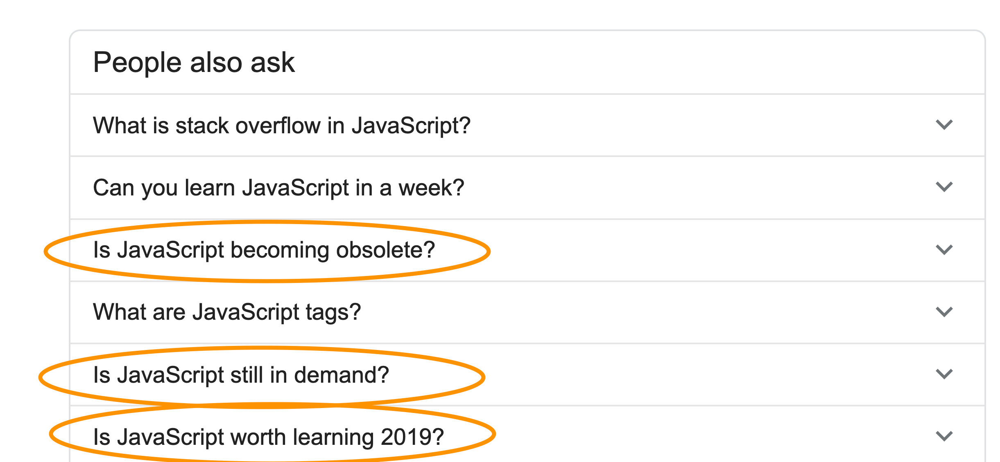

I was searching for some JavaScript related questions on Google when I noticed Google suggesting me in the "People also ask" box some questions I thought pretty funny:

Those got my attention.

Clicking the answer of led me to a reassuring answer, as I expected without a doubt. But I also had my own thoughts on the topic, so I though "let me write them"!

Let's get it straight: **JavaScript is more alive than ever**.

JavaScript has never been more popular than today. And it's never been more powerful than today.

When I started learning about JS in the late 90's, the vast majority of the developers used it to make snow rain on the website at Christmas, show alert and dialog boxes, and do all weird kinds of effects. It was kinda fun, but only the pros would use it to create things more complicated than a poll or something.

When I got into JS seriously in 2012-2013, JS was much more serious. Gmail, Google Maps and other thick client applications showed us all what was possible with JavaScript. Node.js was just starting to become popular but the number of people using it in production was thin.

Nowadays many people learn JavaScript as their first and only programming language. And they might never learn another one for years, because I'd say that thanks to being the only language that works inside Web browsers, JavaScript is **the most popular and powerful language in the entire world**.

If anyone tells you any different, maybe it's because their favorite programming language is much less popular and they hope one day people stop using JS and use the one they invested so much into :)